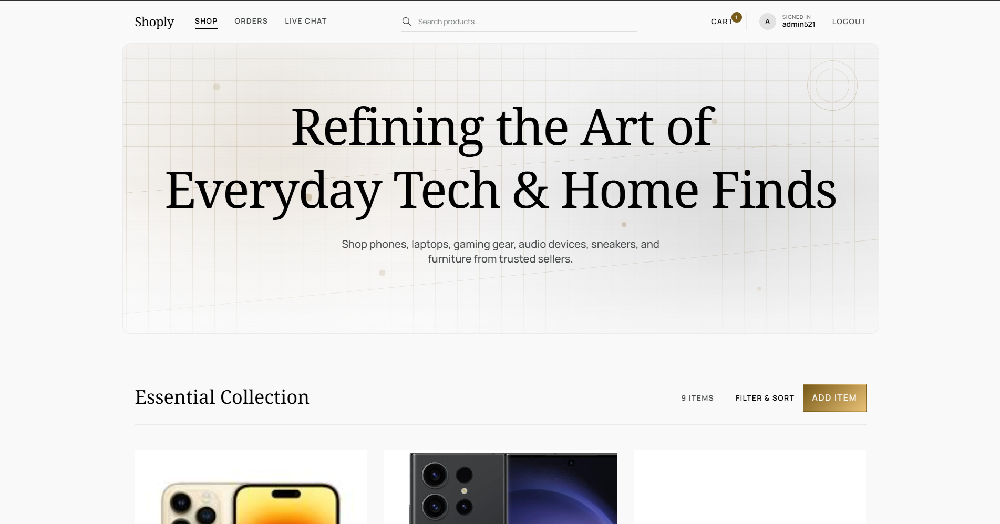
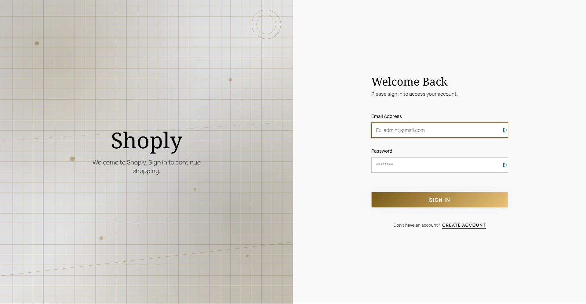
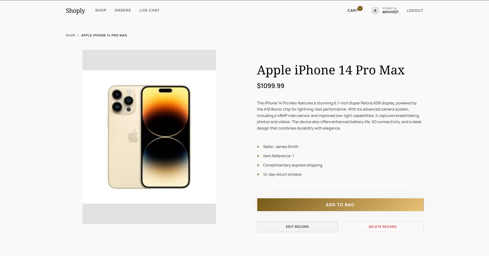
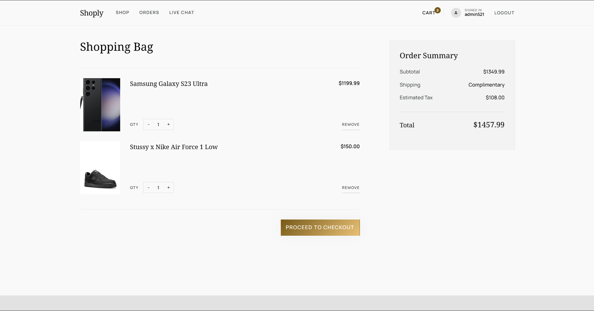

# Shoply E-Commerce Site

## 📸 App Previews

### Login Page

### Product Page

### Checkout Page

https://github.com/HarishK21/E-CommercePlatform

## 📜 Overview

Shoply is a community-driven MERN stack e-commerce platform for buying and selling a large variety of items in one marketplace. Users can create and edit product listings, buy products, and view their order history. Admins can manage items and delete them when necessary.

In the future, additional functionality could be added, for example, filtering items by type, a more robust implementation to manage account and listings, adding security questions and a captcha, and some payment integration with libraries like Stripe JS.

---

## 🧑‍💻 Team Members

- Ninh Dang
- Ranbir Gill
- Harish Kiritharan
- Stephen Nguyen

## 📝 Features

- **User Authentication:** 
  - Register, log in, and log out with token-based sessions.
  - Access protected routes like profile, cart, and orders using bearer tokens.
- **List an Item**:
  - Users can list an item on the store.
  - Users can modify their listings at any time.
  - Provide a name, brief description, an image, and a price.
- **View Orders**:
  - Users can view their previous orders.
- **Shopping Cart**:
  - Users can add items to their shopping carts and then check out.
  - Users can modify their shopping cart to their needs.
- **Admin Features**:
  - Admins can manage any listing; non-admin users can only edit/delete their own items.
- **Realtime Chat**:
  - Socket.IO-powered live messaging route at `/realtime`.
- **Persistent Cart API**:
  - Cart is stored server-side per authenticated user and supports add/update/remove/clear operations.
- **Responsive Design**:
  - Works on various devices, ie. Phone, Laptop, Desktop, etc.
- **Smooth Navigation UX**:
  - Framer Motion page transitions with scroll-to-top behavior on route changes.

## 🤖 Technologies Used

- **Frontend:** React, Vite, CSS
- **Backend:** Node.js, Express, Socket.IO
- **Database:** MongoDB

## 🏗️ Setup

**Prerequisites:** Node.js, npm, MongoDB (running locally).

1. **Clone the repository**
  - HTTPS: `git clone https://github.com/HarishK21/E-CommercePlatform.git`
  - SSH: `git clone git@github.com:HarishK21/E-CommercePlatform.git`
2. **Start MongoDB** on your machine (if not already running).
3. **Backend**
  - `cd backend`
  - `npm install`
  - `node server.js` — API runs on **[http://localhost:8080](http://localhost:8080)** (or `PORT` from `.env`).
4. **Frontend** (in a second terminal)
  - `cd frontend`
  - `npm install`
  - `npm run dev` — open the localhost URL shown in the terminal.
5. Sign in with a [seeded user](#-seeded-users) (if configured) or create an account.

**Environment:** In `backend`, create a `.env` file from `backend/.env.example`.

- Required: `MONGODB_URI`
- Optional: `PORT`, `SESSION_TTL_MS`, `REQUEST_BODY_LIMIT`, `API_RATE_LIMIT_WINDOW_MS`, `API_RATE_LIMIT_MAX`, `AUTH_RATE_LIMIT_WINDOW_MINUTES`, `AUTH_RATE_LIMIT_MAX`, `SEED_USERS_JSON`

**Version control:** The project uses meaningful, descriptive commit messages to track changes (e.g. feature additions, bug fixes, docs updates).

## 👤 Seeded Users

When the backend starts with an empty database, public demo users from `backend/data/users.json` are seeded automatically. You can sign in with any of these:

| Name     | Email                                                             | Password    | Role  |
| -------- | ----------------------------------------------------------------- | ----------- | ----- |
| admin521 | [admin521@gmail.com](mailto:admin521@gmail.com)                   | 521admin521 | admin |
| Gill123  | [gill123@gmail.com](mailto:gill123@gmail.com)                     | S1234       | user  |
| test123  | [test123@gmail.com](mailto:test123@gmail.com)                     | test123     | user  |
| Admin    | [admin@gmail.com](mailto:admin@gmail.com)                         | admin123    | admin |
| Test     | [unique_verify_2026@demo.com](mailto:unique_verify_2026@demo.com) | password    | user  |

`SEED_USERS_JSON` in `backend/.env` can override these defaults.

## 🛣️ Routes

All API routes are under the base URL `**/api`** (e.g. `http://localhost:8080/api`).

| Mount        | Purpose                                           |
| ------------ | ------------------------------------------------- |
| `/api/items` | Item CRUD (store products)                        |
| `/api`       | Auth: register/login/logout/profile; Orders; Cart |

Health check: `GET /` returns `{ status: 'ok', message: 'Shoply API is running' }`.
Socket.IO endpoint is available on the same backend origin.

## 📡 API Reference

**Base URL:** `http://localhost:8080/api` (or your `PORT`).  
Responses use JSON. Error responses include `{ success: false, message: "..." }` where applicable.
Protected endpoints require `Authorization: Bearer <token>`.

### Items (`/api/items`)

| Method   | Path             | Description                                                                                                                                            |
| -------- | ---------------- | ------------------------------------------------------------------------------------------------------------------------------------------------------ |
| `GET`    | `/api/items`     | List all items. **Query:** `minPrice`, `maxPrice`, `sort` (`price_asc`, `price_desc`, `newest`).                                                       |
| `GET`    | `/api/items/:id` | Get one item by numeric `id`. 404 if not found.                                                                                                        |
| `POST`   | `/api/items`     | Create item. **Body:** `name` (required), `price` (required), `description`, `postedBy`, `userId`, `hasImage`, `imageURL`. Returns 201 + created item. |
| `PUT`    | `/api/items/:id` | Update item. **Body:** any of `name`, `description`, `postedBy`, `userId`, `price`, `hasImage`, `imageURL`. Returns 200 + updated item.                |
| `DELETE` | `/api/items/:id` | Delete item by numeric `id`. Returns 204 on success, 404 if not found.                                                                                 |

### Auth (`/api`)

| Method | Path            | Description                                                                                                                |
| ------ | --------------- | -------------------------------------------------------------------------------------------------------------------------- |
| `POST` | `/api/register` | Register. **Body:** `name`, `email`, `password`. Returns 201 or 409 if email exists.                                       |
| `POST` | `/api/login`    | Login. **Body:** `email`, `password`. Returns 200 + `{ success, message, token, user: { id, name, email, role } }` or 401. |
| `POST` | `/api/logout`   | Logout current authenticated session. Requires bearer token.                                                               |
| `GET`  | `/api/me`       | Return current authenticated user. Requires bearer token.                                                                  |

### Orders (`/api`)

| Method | Path                  | Description                                                                                                                                                                                     |
| ------ | --------------------- | ----------------------------------------------------------------------------------------------------------------------------------------------------------------------------------------------- |
| `POST` | `/api/order`          | Create order. **Body:** `firstName`, `lastName`, `email`, `address`, `city`, `postalCode`, `cardName`, `cardNumber`, `cardExpiry`, `cardCVV`, `totalPrice`, `items`. Returns 201 + saved order. |
| `POST` | `/api/orders`         | Alias of `/api/order`.                                                                                                                                                                          |
| `GET`  | `/api/orders/:userID` | List orders for user. **Params:** `userID` (numeric). Returns 200 + array of orders (newest first).                                                                                             |

### Cart (`/api`)

| Method   | Path                      | Description                                                             |
| -------- | ------------------------- | ----------------------------------------------------------------------- |
| `GET`    | `/api/cart`               | Get authenticated user's cart. Returns `{ success, items }`.            |
| `POST`   | `/api/cart/items`         | Add item to cart. **Body:** `itemId`, optional `quantity` (default 1).  |
| `PATCH`  | `/api/cart/items/:itemId` | Update quantity for a cart item. **Body:** `quantity` (0 removes item). |
| `DELETE` | `/api/cart/items/:itemId` | Remove one item from cart.                                              |
| `DELETE` | `/api/cart`               | Clear authenticated user's cart.                                        |

## 🗃️ Database Structure

- **Users:** Stores user information (`id`, `name`, `email`, `password`, `role`).
- **Items:** Stores the store products (`id`, `name`, `description`, `postedBy`, `userId`, `price`, `hasImage`, `imageURL`)
- **Orders:** Stores the user placed orders (`id`, `firstName`, `lastName`, `userId`, `email`, `address`, `city`, `postalCode`, `cardName`, `cardNumber`, `expiryDate`, `cvv`, `totalPrice`, `items`)

## 💭 Reflection

Overall, this was our first MERN stack project MongoDB + Express + React + Node.js of this scale. It was quite the exciting experience being able to utilize the full stack we learned to create a functional E-Commerce platform. Being able to use React + Express really simplifies and makes the code more modular and reusable compared to plain HTML, CSS and JavaScript. Compared to using a JSON list or MySQL, MongoDB felt more modern and compelling because its document-based design allows data to be stored and managed more flexibly. 

To add onto the second project, we were able to implement full Authentication, Real Time Communication via a web socket, proper error handling, and a complete, refined UI as defined by the Nielson usability principles.

Along the way, we had many different challenges and successes, mainly with the setup process, new components like the Web Sockets, and the final integration with all the components and the MongoDB database. Though, in the end, with a little bit of patience, thinking, and collaberation we were able to overcome these issues and create a working product. Overall, this was a great experience for us all, and we were all able to contribute well and learn along the way while making this project.

## 💡 Future Enhancements

- Further enhance UI: product categories, clearance section
- Payment Integration: stripe
- Additional anti-abuse features: captcha codes, security questions
- User management menu: accounts, passwords, payment methods

---

## 🚀 Recent Improvements (Stephen Nguyen)

### Backend Enhancement

**Error Handling:**
- Created centralized error handling middleware (`backend/middleware/errorHandler.js`) for consistent error responses across all API endpoints
  - Catches all errors thrown in route handlers automatically
  - Handles specific error types (Mongoose CastError, duplicate key, validation errors, JWT errors)
  - Returns consistent JSON error responses with `{ success: false, message: "..." }`
  - Logs errors with detailed information (message, status, stack, path, method, timestamp)
  - Shows stack traces only in development mode for security
  - Provides 404 handler for unknown routes

### Frontend Enhancement

**User Experience (UX):**
- Added Loading Spinner component (`frontend/src/Components/UI/LoadingSpinner.jsx`) for visual feedback during loading states with customizable sizes and colors
  - Supports different sizes (sm, md, lg, xl)
  - Multiple color options (blue, green, red, white, gray)
  - Can be used as inline spinner or full-screen overlay
  - Non-intrusive and doesn't affect existing functionality

These improvements enhance error handling consistency and user experience without modifying any existing features or functionality.

